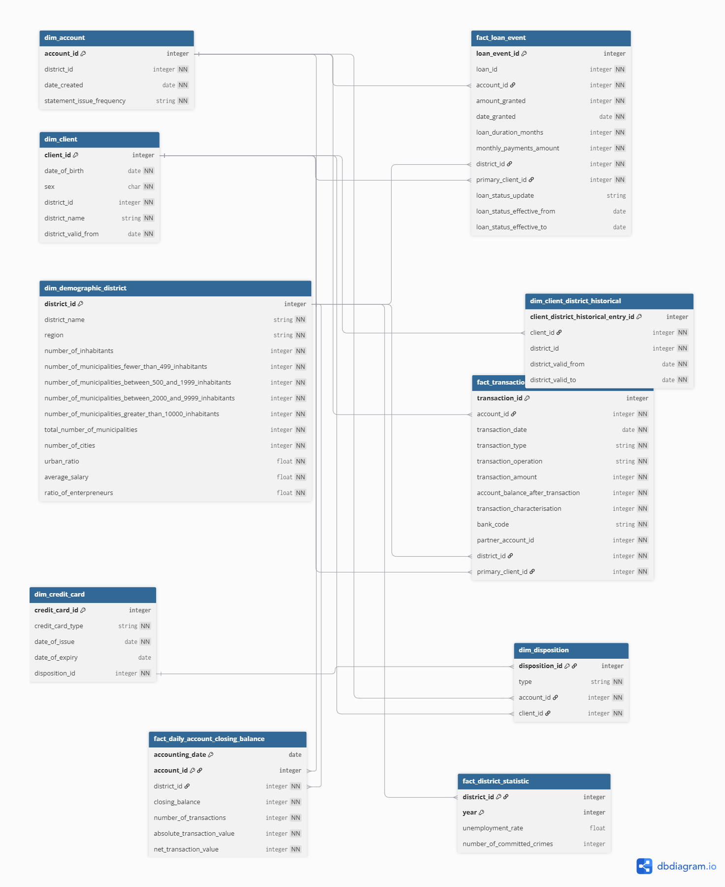
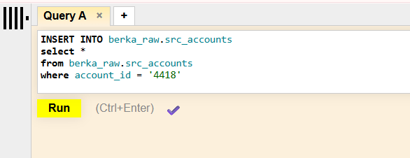
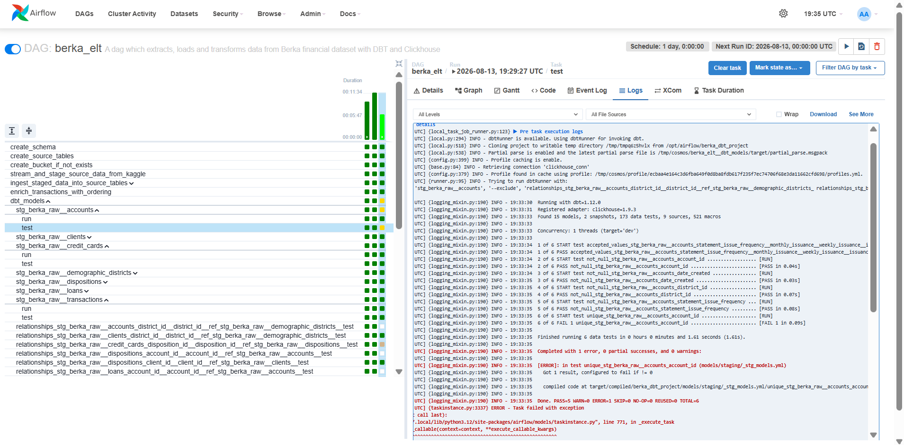

# berka-data-engineering-project

## Overview of the project and the business problem
Retail banks generate enormous volumes of transactional data every day. Account holders make payments, take out loans, and operate credit cards across multiple branches and time periods. Without a structured analytics layer on top of this activity, the data sits in an operational system that was designed for writes, not analysis. Answering even basic questions like "what is the loan default rate by district?" or "which clients hold both a credit card and an active loan?" becomes expensive and slow.

This project automates the process of extracting that operational data, staging it in object storage, validating it, modelling it into an analytical schema, and loading it into a data warehouse. The source is the Berka Dataset, a collection of real anonymised financial records from a Czech bank, originally released for the PKDD'99 Discovery Challenge. It covers 5,369 clients, 4,500 accounts, over 1 million transactions, 682 loans, and 892 credit cards, spread across 8 relational tables.

The business problem this pipeline addresses is straightforward: the bank's operational data cannot support reporting and analytics in its current form. Queries over raw OLTP tables are slow, joins are complex, and there is no consistent logic for how metrics like balance movement or loan performance are calculated. A data engineer's job here is to move this data into a warehouse in a shape that analysts can actually use, reliably and repeatably.

The business value delivered:
* Timely access to integrated financial data for dashboards and reporting
* Data consistency and schema enforcement across all 8 source tables
* A dimensional model that makes cross-table analysis straightforward
* Automation that removes manual overhead and makes the pipeline repeatable


### Dataset
The dataset is the Berka Dataset (PKDD'99 Czech Financial Dataset), a collection of real anonymised records from a Czech bank spanning the years 1993 to 1999.

It is available via the Kaggle API at:
https://www.kaggle.com/datasets/marceloventura/the-berka-dataset

## Pipeline Architecture


## Setup Instructions 
Clone this repo onto your device using by running this command in your terminal:
```
git clone https://github.com/SasheO/berka-data-engineering-project.git
```

Copy `.env_example` into a file named `.env` and fill in your environment variables.
The environment variables you should change start with `fill_in_`.
Set `MINIO_ROOT_USER` to `admin` and pick your preferred MinIO password.
Set `CLICKHOUSE_USER` to `default` and pick your preferred ClickHouse password.
Create Kaggle login credentials using api key, put credentials in .env file as `KAGGLE_USERNAME` and `KAGGLE_KEY`

To configure user permissions:
* If you’re using Linux, set a user ID to prevent permission issues when Docker writes files locally. Run this in your terminal and copy the value into `AIRFLOW_UID` in your `.env` file:
```
echo -e "AIRFLOW_UID=$(id -u)"
```
* If you’re using macOS or Windows, leave the value in your `.env` file as is: `AIRFLOW_UID=50000`

### Directory structure
```
|   .dockerignore
|   .env_example
|   compose.yaml
|   Dockerfile
|   README.md
|   requirements.txt
|   
+---berka_dbt_project
|   |   dbt_project.yml
|   |   
|   +---models              # contains staging, fact and dimension models and their corresponding .yml file for documentation, sources and tests, except snapshots
|   |   +---marts                                             
|   |   +---staging
|   +---snapshots           # contains snapshot models and their corresponding .yml file for documentation and tests
+---dags
|   |   berka_elt.py
|   |         
+---images                  # contains images of pipeline architecture, dimensional model, README images, and screenshots of DAG while running
|   |   
|   +---screenshots of DAG
|           
+---include
|   +---sql                 # contains ClickHouse sql scripts used for initial creation of and ingestion into source tables
|               
+---plugins
    |   helpers.py          # contains helper functions used in DAG
            
```

### Set Up Connections and Variables in Airflow
In your terminal, navigate to the folder where this repository is stored and run `docker compose up`.

Open up the Airflow webserver in a browser at [http://localhost:8080/](http://localhost:8080/). 

Go to `admin` > `connections` and click the `+` sign to create a new connection. The connections to add are:

**Clickhouse:**
* name: clickhouse_conn
* connection type: clickhouse
* host name: clickhouse-server
* login and password: use your credentials in .env for login and password
* port 8123


**Minio:**
* name: minio_conn
* connection type: AWS connection type
* login and password: use your credentials in .env for login and password
* extras: Copy what is below into the text box and replace MINIO_ROOT_USER and MINIO_PASSWORD with what is in your .env file.
```
{
        "aws_access_key_id": MINIO_ROOT_USER, 
    "aws_secret_access_key": MINIO_PASSWORD,
    "endpoint_url": "http://minio:9000",
    "region_name": "us-east-1"
    }
```
If you test the MinIO connections, it may fail. This is completely normal because Airflow's test engine inherently tries to reach the live AWS Security Token Service (STS) endpoint to validate credentials, which local MinIO services do not support. Save the connection anyway. It will still work perfectly in your DAGs.

**Variables:**

Go to `admin` > `Variable` and click the `+` sign to create a new variable. The variables to add are:
set up variabes in airflow:
* name: minio_endpoint
    
    value: http://minio:9000
* name: minio_password
    
    value: what is in your .env file.
* name: minio_username
    
    value: what is in your .env file.


## Steps to Run the DAG and Inspect Results by Querying ClickHouse Tables
From the [Airflow webserver](http://localhost:8080/), type in  "berka_elt" in the search bar to find the DAG. Click on the berka DAG.

Toggle the button at the top-left of the screen to unpause the DAG. If the pipeline does not get automatically triggerred after unpausing it, you can trigger it by clicking the play button at the top-left of the page.

The DAG will run and populate various staging, dimension, snapshot, and fact tables in `berka_analytics` schema. The source data that was ingested raw will be in `berka_raw` schema.

To query ClickHouse tables, open up the ClickHouse Web UI at http://localhost:8123/. Put in your default username and password in the dialogue boxes for credentials at the top left of the screen. Run your queries in the query box. Some sample queries are: 

```sql
-- Sample query that answers "What is the total transaction volume per account per month?"
SELECT
    year(transaction_date) as "year", 
    month(transaction_date) as "month", 
    account_id, 
    round(sum(transaction_amount), 2) as total_monthly_transaction_volume
FROM berka_analytics.fact_transaction
GROUP BY "year", "month", account_id
ORDER BY account_id, "year", "month";

-- Sample query that answers "Which districts have the highest loan default rates?"
WITH
    all_loans AS (
        SELECT  
            COUNT(DISTINCT loan_id) AS all_loan_count, district_id
        FROM berka_analytics.fact_loan_event AS fle
        JOIN berka_analytics.dim_account AS da
        ON fle.account_id = da.account_id
        GROUP BY district_id
    ),
    defaulted_loans AS (
            SELECT  
            COUNT(DISTINCT loan_id) AS defaulted_loan_count, district_id
        FROM berka_analytics.fact_loan_event AS fle
        JOIN berka_analytics.dim_account AS da
        ON fle.account_id = da.account_id
        WHERE loan_status_update in ('contract finished, loan not payed', 'running contract, client in debt')
        GROUP BY district_id
    )
SELECT
    al.district_id as district_id,
    defaulted_loan_count,
    all_loan_count,
    (defaulted_loan_count/all_loan_count) as fraction_of_defaulted_loans
FROM all_loans al 
LEFT JOIN defaulted_loans dl
ON al.district_id = dl.district_id
ORDER BY fraction_of_defaulted_loans DESC;

-- Sample query that answers "What is the balance trend over time for accounts that also have a credit card?"
SELECT 
    account_id,
    accounting_date,
    closing_balance
FROM berka_analytics.fact_daily_account_closing_balance
WHERE account_id in 
    (
    SELECT 
        account_id
    FROM berka_analytics.dim_disposition
    WHERE disposition_id IN (
        SELECT
            disposition_id
        FROM berka_analytics.dim_credit_card
    )
)
ORDER BY account_id, accounting_date;

```

The DAG will also generate DBT docs with descriptions of tables, columns, relationships, dependencies, data tests, and more which are viewable within the Airflow webserver if you click `browse` > `DBT Docs`.

## Dimensional Model
Here is a link to the dimensional model with description on each table and many fields: [Dimensonal Model](https://dbdiagram.io/d/berka-dataset-v2-6a4e96184ac62e474c5dd29c). 





DBT Docs in the Airflow webserver also shows this same information but on a physical implementation rather than logical level.

### Reasons for Various Design Choices
Although the data source is historical and small in size, I designed the dimensional model with the assumption that the data would grow and considering plausible business requirements of a modern bank today.

For example, the history of a client's district is stored in an SCD type 4 table `dim_client_district_historical` because customers can move frequently and change addresses, meaning that history tracking within the same table (e.g. SCD type 2) could lead to a needlessly bloated dimension table.

Some guiding questions I started this design process with were:
> What is the total transaction volume per account per month?

> Which districts have the highest loan default rates?

> How do client demographics correlate with loan outcomes?

> What is the balance trend over time for accounts that also have a credit card?

Many models are denormalised. For example, `dim_client` does not only include a `district_id` foreign key column that joins to the `dim_demographic_district` dimension table, but it also includes duplicated `district_name` field. This is because I wanted most common potential questions a business user would ask (like the ones above) to be answerable in three JOINS or less as the database used is ClickHouse, a JOIN-slow OLAP database.

Lastly, the permenant order relation in the source data is absent from the dimensional model as it lacks a time series or dating. Thus, this data would be not very useful for analytics.

## Tests and Validation
Appropriate unique, not null, accepted values, and relationships tests are implemented in every model. Full documentations can be viewed in DBT docs in the Airflow webserver (click `browse` > `DBT Docs`).

Failure of various any of these tests would lead to the pipeline being blocked when the Airflow task fails, preventing data quality issues from propagating to downstream models.

To test run this, I ran a query that inserts duplicate rows in the source table for bank accounts:


While in other runs, the staging model for bank accounts (which is materialised as a view on the source table) passes all its data quality checks, after running the above query, the unique tests fail:



## Known limitations and ideas for extending the project

The major limitations of this dataset comes from the source data which is historical. Thus, though there are various fact, dimensional, and snapshot tables, they never change because they are populated with the same data at each run. Ideas for extending this project include finding a real-time source of financial bank data rather than a historical one.